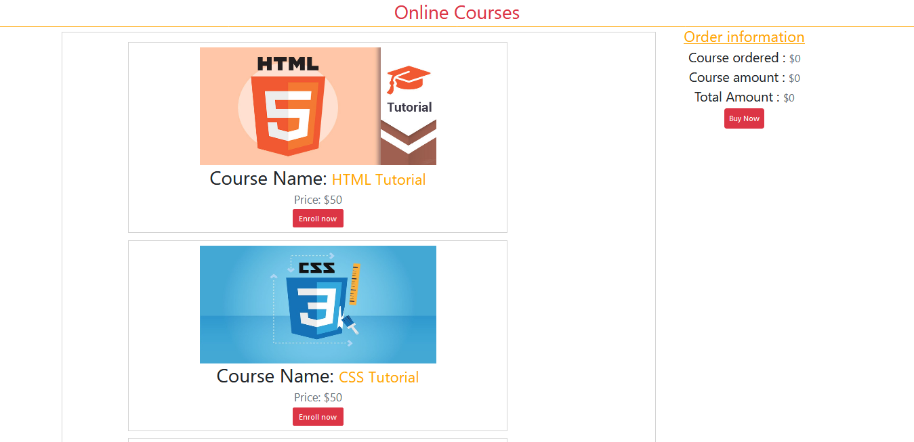

<h1>Online Courses</h1>

<h2><a href="https://zealous-shaw-e561cf.netlify.app/">Live</a></h2>
<h2>Features</h2>
<ul>
  <li>Users easily find his courses.</li>
  <li>How many course users buy and the total amount everything's
      shown on this site.
  </li>
  <li>In this site mainly focused on React core concept , Like</li>
    <ol>
        <li>How to product add on cart.</li>
        <li>How to increment and decrement the order product
        number when customers order a product and cancel a
        product.
        </li>
    </ol> 
</ul>  
<h2>Technology</h2>
<ul>
    <li>Core React JS</li>
    <li>Material-UI.</li>
    <li>Html5</li>
    <li>Css3</li>
</ul>